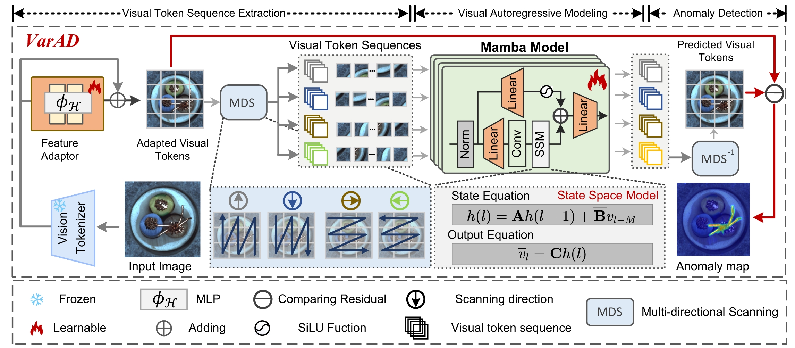
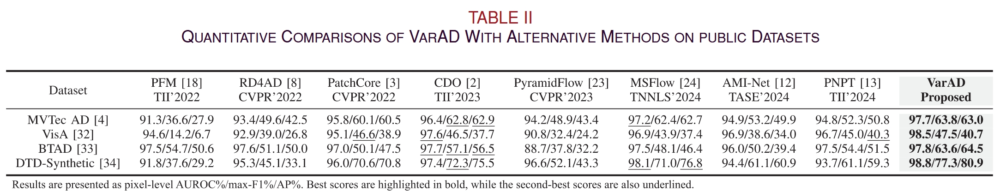

# VarAD: Lightweight High-Resolution Image Anomaly Detection via Visual Autoregressive Modeling


## Abstract

> This article addresses a practical task: high-resolution image anomaly detection (HRIAD). In comparison to conventional image anomaly detection for low-resolution images, HRIAD imposes a heavier computational burden and necessitates superior global information capture capacity. To tackle HRIAD, this article translates image anomaly detection into visual token prediction and proposes visual autoregressive modeling-based anomaly detection (VarAD) based on visual autoregressive modeling for token prediction. Specifically, VarAD first extracts multi-hierarchy and multi-directional visual token sequences, and then employs an advanced model, Mamba, for visual autoregressive modeling and token prediction. During the prediction process, VarAD effectively exploits information from all preceding tokens to predict the target token. Finally, the discrepancies between predicted tokens and original tokens are utilized to score anomalies. Comprehensive experiments on four publicly available datasets and a real-world button inspection dataset demonstrate that the proposed VarAD achieves superior HRIAD performance while maintaining lightweight, rendering VarAD a viable solution for HRIAD.

## Framework



## Install

```bash
sh init.sh # note that there may be some remained bugs
```

Modify `./config/global_config.py` to match your data directory.

## Run

```bash
python main.py --image_size 512 --model dinov2_vits14
```

## Performance under 1024 Resolution



## BibTex

```bibtex
@ARTICLE{VarAD,
  author={Cao, Yunkang and Yao, Haiming and Luo, Wei and Shen, Weiming},
  journal={IEEE Transactions on Industrial Informatics}, 
  title={VarAD: Lightweight High-Resolution Image Anomaly Detection via Visual Autoregressive Modeling}, 
  year={2025},
  volume={21},
  number={4},
  pages={3246-3255},
  keywords={Visualization;Predictive models;Adaptation models;Anomaly detection;Reactive power;Transformers;Image reconstruction;Computational modeling;Inspection;Feature extraction;Autoregressive modeling;image anomaly detection;token prediction},
  doi={10.1109/TII.2024.3523574}}
```

## Index Terms

- Autoregressive modeling
- Image anomaly detection
- Token prediction
